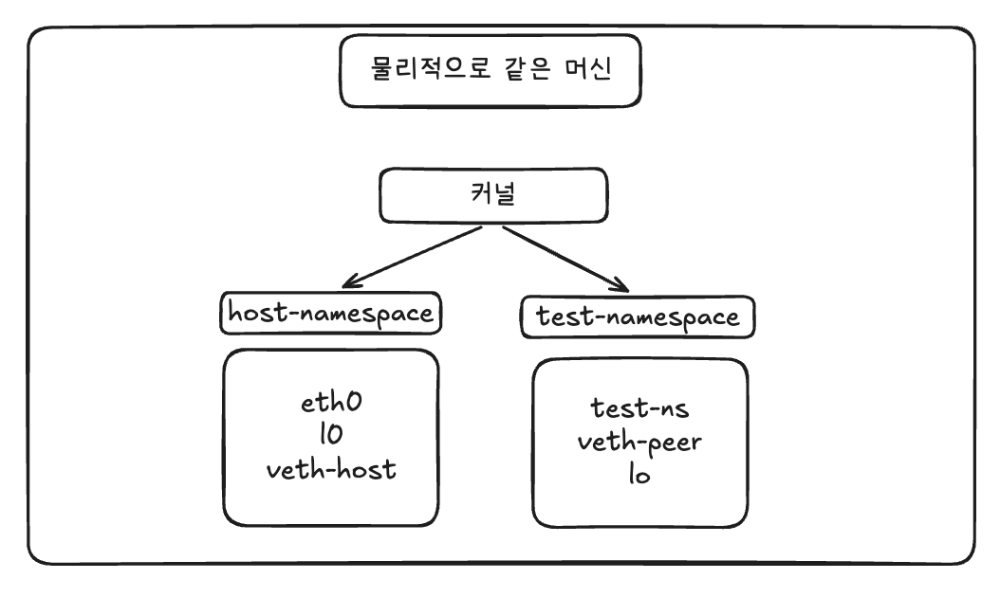

리눅스의 Namespace는 프로세스가 바라보는 시스템 ```자원의 "범위"를 격리```하는 기술이다. 

자원이라는 것의 종류가 다양한 만큼, Namespace의 종류도 다양한데, 그중 Network Namepsace에 대해 알아본다. 
**Network Namespace**는 다음을 격리한다. 

- 네트워크 인터페이스
- 라우팅 테이블
- iptables 규칙 
- 소켓(port) 

즉, 각 namespace는 서로 독립적인 network stack을 갖는다. Docker container가 사로 다른 IP를 갖고, 포트 충돌이 없는 이유가 바로 이것 때문이다.  

ex) 
```
# 두 컨테이너가 모두 8080 포트 사용 → 충돌 안 함
docker run -p 8081:8080 nginx   # container-1 namespace
docker run -p 8082:8080 nginx   # container-2 namespace
```

예를 들어 두개의 Docker container가 모두 8080 포트를 사용해도 충돌이 없다. 서로 다른 namespace에 있기 때문이다.  




