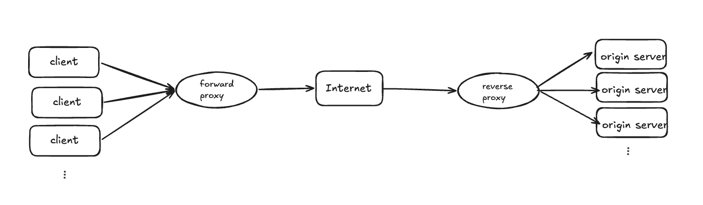

# 프록시 

### Forward Proxy(Gateway)
- 클라이언트의 요청을 대신하여 작동함 
- 클라이언트의 ID를 숨겨 클라이언트 익명성 보장 
- 클라이언트 요청이 forward proxy에서 시작된 것처럼 할 수 있음.

### Reverse Proxy
- Load Balancing : 부하를 여러 오리진 서버에 분산 
- Cache static content : 사진과 같은 정적 컨텐츠를 캐싱
- Compression : 컨텐츠를 압축하고 최적화


 
**nginx예제**

```json
location /some/path/ {
proxy_pass http://www.example.com/link/;
}
```
내서버의 /some/path 경로로 요청하면, nginX가 ```http//www.example.com/link/``` 로 요청을 대신 보냄

**Reverse Proxy를 두었을때의 장점은,** 
1. 내부 서버 구조를 숨길 수 있음. 클라이언트가 직접 내부 서버에 접근하게 되면, IP, 포트, 서버구조가 노출되지만,  
   리버스 프록시를 앞에 두면 클라이언트는 nginX주소만 알면 된다. 
2. 로드 밸런싱  
   내부 서버가 여러 대일 때 요청을 분산시킬 수 있다.
3. SSL 처리   
    Https 암호화/복호화를 리버스 프록시에서 한번에 처리하면 내부 서버들은 Http로만 통신해도 됨. 
4. 캐싱  
    자주 요청되는 응답을 프록시에 캐싱
    
